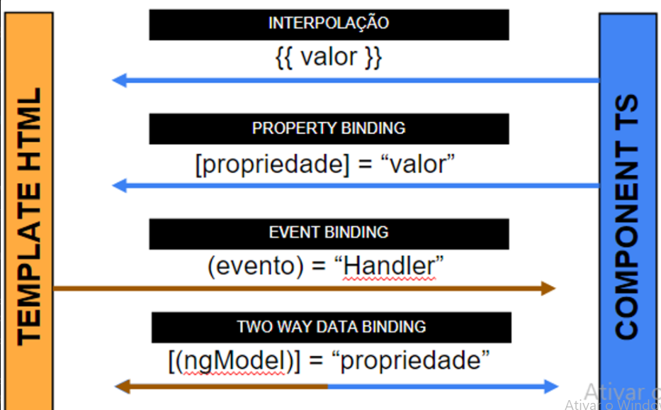
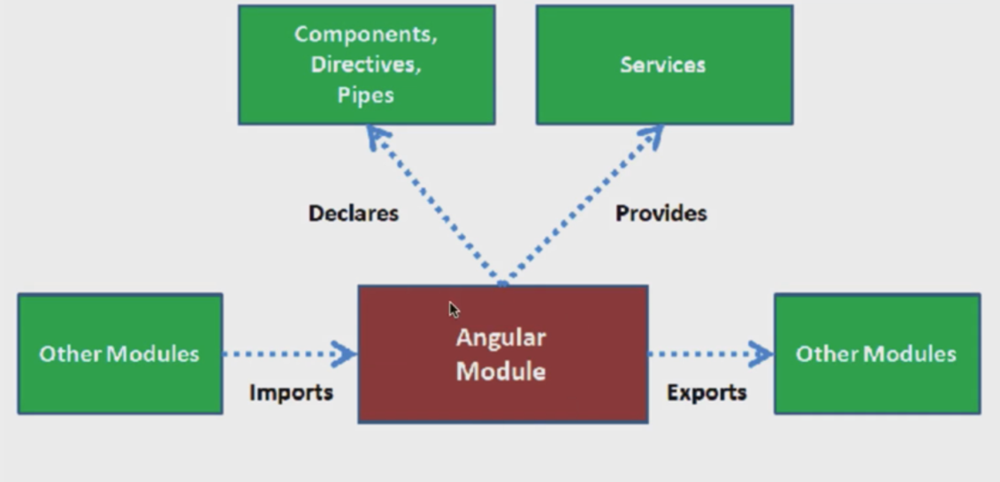
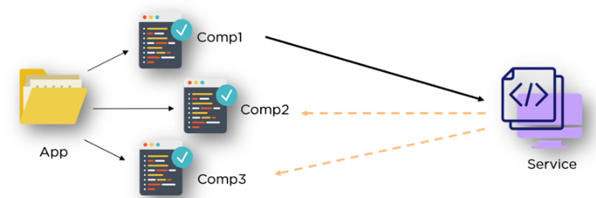

# Estudo sobre Angular 
## Diretivas 

**Diretiva é a maneira como o angular manipula e altera a DOM dinâmicamente**

### Diretivas de atributo

Alteram a aparência ou comportamento de um elemento, componente ou outra diretiva

- NgClass - Adiciona ou remove conjunto de classes CSS
- NgModel - Adiciona vinculação de dados bidirecional a um elemento de um formulário
- NgStyle - Adiciona ou remove um conjunto de estilos ao HTML

### Diretivas estruturais
Moldam ou remodelam a estrutura da DOM, adicionando ou removendo elementos na tela.
- NgIf - Condicional que verifica se modelo deve ser visualizado ou não - O ngIf ele pode ser usado tanto nos componentes filho, tanto no componente pai.

-  NgFor - repete um elemento para cada item em uma lista
- NgSwitch - Utilizado para alternar entre comportamentos alternativos.


## Componentes
Toda classe que representa um componente no Angular deve ser  decorada com `@Component`

Esse decorator recebe alguns parâmetros. Como:

- selector = seletor para usar o importar o componente em outros arquivos
- templateUrl = path para o template HTML desse componente
- styleUrl = array de paths para arquivos de estilo a serem aplicados nesse componente

## Ciclo de vida dos Componentes
Podemos reagir a etapas do ciclo de vida do componente através dos `lifecycle hooks`

> Os hooks dão a você a oportunidade de agir em uma instância de componente ou diretiva no momento apropriado, conforme o Angular cria, atualiza ou destrói essa instância.
>

## Associação de dados
Ele se refere à sincronização automática de dados entre o modelo (a parte lógica e de dados do aplicativo) e a visualização (a interface do usuário).


### Tipos de Associações
-  **Property Binding**: Liga propriedades do componente filho a valores do componente pai usando [ ]. <br>

- **Event Binding**: É um recurso que permite que você responda a eventos do usuário, como cliques do mouse, pressionamentos de teclas, etc. Ele é usado para capturar eventos do DOM (Documento Object Model)
- **Two Way data binding**: Combinação de one-way data binding e event binding. Permite que as alterações no modelo atualizem a visualização e vice-versa. No Angular, é frequentemente usado com a diretiva ngModel.


## Módulos
No Angular, os módulos são uma parte fundamental da arquitetura da aplicação. Eles são usados para organizar e estruturar o código em partes reutilizáveis e independentes.


## Rotas
Dentro do arquivo `app.routing.module` podemos definir as rotas do nosso projeto, no array de Routes

## Services
Os serviços desempenham um papel fundamental como fornecedores de funcionalidades reutilizáveis e compartilhadas em toda a aplicação.

> Um service não está ligado a apenas um componente, ele atende vários componentes
>


### Porque usar service? <br>
**Compartilhamento de Dados:**

- Os serviços são usados para compartilhar dados e funcionalidades entre componentes. Eles atuam como contêineres de lógica de negócios e dados que podem ser acessados por diferentes partes da aplicação.

**Injeção de Dependência:**

- Os serviços no Angular são injetáveis, o que significa que podem ser facilmente injetados em componentes, diretivas, outros serviços, etc. Isso facilita a gestão de dependências e torna o código mais modular e testável.

**Integração com APIs e Backend:**

- Serviços são frequentemente utilizados para encapsular chamadas HTTP e interações com APIs ou backends. Isso centraliza a lógica de comunicação, facilitando a manutenção e a atualização.
## Requisição HTTP
Etapas de como fazer uma requisição HTTP 

1. **Importação:** Importa-se o módulo **`HttpClientModule`** no arquivo appModule.app. Esse é o arquivo pai de toda a aplicação e é ele que garante o uso de várias dependencias HTTP, como o HttpClient

```tsx
**Arquivo appModule**
import {  HttpClientModule  } from '@angular/common/http'
```

---

Antes de tratar a requisição, sempre que tivermos trabalhando com uma entidade, é uma boa prática criar uma Interface. Essa interface garante menos erros.

Nessa interface abaixo eu já garanti os dados que virão da requisição. E ela tem quer ser importada no Service e no componente que irá ser manipulada

```tsx
Arquivo de Interface
export interface Pokemon {
    name: string,
    sprites: {
        front_default: string
    },
    types: {
        type: {
            name: string
        }
    }[]

}
```
---
1. **Injeção de Dependência:** Injeta-se o serviço **`HttpClient`** no componente ou serviço que precisa fazer a requisição.
    
    A segunda etapa é; Toda requisição HTTP no angular é feito em um service para boas práticas, então é necessário criar um arquivo service dentro da pasta services e após isso importar o arquivo HttpCLient.
    
    É importante também importar o Observables pois é com ele que podemos tratar resultados assíncronos de forma eficiente, possibilitando manipulação de fluxo, cancelamento de assinaturas e tratamento de erros
    

```tsx
**Arquivo Service
import { Injectable } from '@angular/core'; //Arquivo padrão de todo Service**
import { HttpClient } from '@angular/common/http';
import { Observable } from 'rxjs';
import { Pokemon } from '../models/Pokemon'; // A INTERFACE

@Injectable({
  providedIn: 'root'
})
```

---

1. **Construção da Requisição:** Usa-se o **`HttpClient`** para construir a requisição HTTP (por exemplo, **`get`**, **`post`**, **`put`**, **`delete`**) com o URL da API desejada.

No service é preciso criar um http privado que seja do tipo HttpClient, ou seja, é com esse http que vamos conseguir usar os métodos de requisição. Esse http privado é sepre um parâmetro do constructor.

```tsx
export class PokemonService {
  constructor(private http:HttpClient) {}
}
```

---

Após isso é necessário fazer todo o tratamento da requisição seja ela uma API ou algo que venha do banco de dados e para isso vou dar um exemplo de uma API de pokemon. 

---

```tsx
export class PokemonService {
  pokeApi = environment.pokeApi

  constructor(private http:HttpClient) { 
   
  }

  getAPI(namePokemon: string): Observable<Pokemon> {
    return this.http.get<Pokemon>(`${this.pokeApi}`)
  }

}
```

Agora é a hora de chamar a API, é preciso então criar uma função que retorne um Observable que seja do tipo da Interface.

Essa função então retorna o http que chama o método get que também é necessário ser do tipo da Interface, como o get é um método é necessário só chamar a URL dentro dele

---

Agora é só importar o service dentro do component que irá receber a resposta da URL e o Interface.

```tsx
import { Component, OnInit } from '@angular/core';
import { Pokemon } from 'src/app/models/Pokemon';
import { PokemonService } from 'src/app/services/pokemon.service';

@Component({
  selector: 'app-pokemon',
  templateUrl: './pokemon.component.html',
  styleUrls: ['./pokemon.component.css']
})

```

É preciso então inicializar o interface dentro do componente e chamar o service no constructor do componente

```tsx
export class PokemonComponent implements OnInit {
  pokemon: Pokemon = {
    name: '',
    sprites: {
      front_default: ''
    },
    types:[]
  }
	constructor(private pokemonService: PokemonService) { }
```

1. **Envio da Requisição:** Chama-se o método **`subscribe()`** na Observable retornada pela chamada HTTP para enviar a requisição e aguardar a resposta e nela ocorre o **Tratamento da Resposta:** onde define-se o que fazer com a resposta recebida da API, como atualizar o estado da aplicação ou realizar outras ações.

Um método então é criado e faz todo o tratamento da api, nesse caso preenche as propriedades do objeto pokemon

## Interfaces 
Toda entidade que vamos trabalhar precisa de uma interface, isso torna o código mais simples facilitando a manutenção. Porém a criação de interfaces ao trabalhar com requisições em Angular não é estritamente necessária, mas é altamente recomendada. Aqui estão algumas razões pelas quais a criação de interfaces é uma prática valiosa:

1. **Tipagem Forte:**
    - As interfaces fornecem uma forma de aplicar tipagem forte aos dados recebidos nas respostas da API. Isso ajuda a detectar erros de digitação ou estrutura no código durante o desenvolvimento, tornando-o mais robusto.
2. **Documentação Embutida:**
    - Ao criar interfaces, você documenta implicitamente a estrutura dos dados que espera receber da API. Outros desenvolvedores (ou você mesmo no futuro) podem facilmente entender a estrutura dos dados olhando para a interface.
